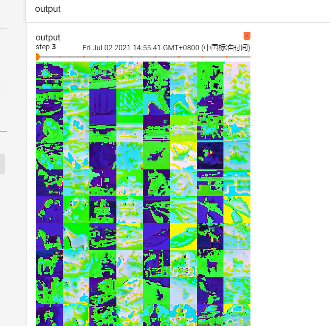

# pyTorch深度学习快速入门

## P6、Dataset类代码实战

**目标一：读取目标路径下的文件名？**

```python
class MyData(Dataset):
    def __init__(self,root_dir,label_dir):
        self.root_dir=root_dir
        self.label_dir=label_dir
        #获得对应的地址
        # root_dir 根目录地址
        # label_path 标签地址，通常只要一个标签的名字，接下来会将他们合起来
        self.path=os.path.join(root_dir,label_dir)
    #     接下来获取对应目录下的图片地址
    #     listdir（）将目录里面的文件转化为一个列表
        self.image_path=os.listdir(self.path)
```


==主要讲解了如何读取有许多数据的文件夹里面的数据==

```python
from torch.utils.data import Dataset
# help(Dataset)
import cv2
from PIL import Image
import os
class MyData(Dataset):
    def __init__(self,root_dir,label_dir):
        self.root_dir=root_dir
        self.label_dir=label_dir
        #获得对应的地址
        # root_dir 根目录地址
        # label_path 标签地址，通常只要一个标签的名字，接下来会将他们合起来
        self.path=os.path.join(root_dir,label_dir)
    #     接下来获取对应目录下的图片地址
    #     listdir（）将目录里面的文件转化为一个列表
        self.image_path=os.listdir(self.path)

    def __getitem__(self, index):
        # 函数作用：获取其中每一个图片
        img_name=self.image_path[index]
        '''将路径的路径的相对地址，标签的名字，图片的名字拼接起来，形成一个真正的图片路径'''
        img_item_path=os.path.join(self.root_dir,self.label_dir,img_name)
        # 获取了对应index的图片
        img=Image.open(img_item_path)
        label=self.label_dir
        return  img,label

    def __len__(self):
        return len(self.image_path)

root_dir='dataResourse/practise/train'
ants_label_dir='ants_image'
bees_label_dir='bees_image'
ants_dataset=MyData(root_dir,ants_label_dir)
bees_dataset=MyData(root_dir,bees_label_dir)

img,label=ants_dataset[0]
"把两个小的数据集进行拼接"
# 作用：可以仿照一个数据集和原来的混着用
train=ants_dataset+bees_dataset

# img2,label2=train[123]
# img2.show()
```


## P7、TensorBoard的使用

### 7.1、

TensorBoard 中有一个SummaryWriter函数可以画图 >-<

```python
from torch.utils.tensorboard import SummaryWriter

writter=SummaryWriter('logs')
for i in range(100):
    writter.add_scalar('y=x',i,i)

writter.close()
```


> tensorboard --logdir=logs


### 读图片


#### 1.用PIL的Image度


读出来的是PIL.JPEG不符合writter.add_image()的类型


#### 2.用OpenCV读取图片，获得numpy类型的图片


#### 3.用numpy


直接运行报错

```
from torch.utils.tensorboard import SummaryWriter
import numpy
from PIL import Image
# test1
'''
writter=SummaryWriter('logs')
for i in range(100):
    writter.add_scalar('y=x',i,i)

writter.close()
'''

# test2
image_path='dataResourse/practise/train/ants_image/0013035.jpg'
image_PIL=Image.open(image_path)
image_array=numpy.array(image_PIL)

writter=SummaryWriter('logs')
writter.add_image("test",image_array,1)

writter.close()
```


经过排查发现是sharp属性不对

默认是


而使用的image_array则是：

(512, 768, 3)与其相反

所以修改格式即可

```
dataformats='HWC'
```

```
writter.add_image("test",image_array,1,dataformats='HWC')
```


## P9、Transforms的使用

Transforms**结构及用法**


<PIL.JpegImagePlugin.JpegImageFile image mode=RGB size=500x500 at 0x1B6FDFA9F98>


```python
from PIL import Image
from torchvision import transforms

# python的用法-》   tensor数据类型
# 通过tensform.totensor去解决两个问题
# 1.transforms该如何使用
# 2.tensor数据类型相比其他数据类型有什么区别

# 绝对路径 G:\workSpace\new_code\python_learing\deeplearning\dataResourse\practise\train\ants_image\20935278_9190345f6b.jpg
# 相对路径 dataResourse/practise/train/ants_image/67270775_e9fdf77e9d.jpg

img_path = 'dataResourse/practise/train/ants_image/67270775_e9fdf77e9d.jpg'
img = Image.open(img_path)

print(img)
# 实例化对象，再调用，实现call方法， 再传进去参数    transforms不能传参
tensor_trans=transforms.ToTensor()
tensor_img=tensor_trans(img)#ctrl+p
print(tensor_img)
```


```tensorboard --logdir=logs
tensorboard --logdir=logs
```


## p10、常见的Transfroms


python中内置函数**==__call__==**的使用

——call——：可以在实例化时传入参数，就自动运行call的方法

其他类里面的方法。都需要再实例化之后再通过类.方法名来调用

```python
class Person():
    def __call__(self, name):
        print("__call__"+"hello"+name)

    def hello(self,name):
        print("hello"+name)

person=Person()
person("zhangsan")
person.hello('lisi')
```


### 1.Normalize归一化


```python
from PIL import Image
from torch.utils.tensorboard import SummaryWriter
from torchvision import transforms

writer=SummaryWriter('logs')
img=Image.open('image/img.png')
print(img)

trans_totensor=transforms.ToTensor()
tensor_img=trans_totensor(img)
writer.add_image('to_tensor',tensor_img)
writer.close()

#normalize
print(tensor_img[0][0][0])
trans_norm=transforms.Normalize([1,2,4],[4,5,1])
img_norm=trans_norm(tensor_img)
print(img_norm[0][0][0])
writer.add_image('normalize',tensor_img,1)

writer.close()
```

### 总结使用

```python
from PIL import Image
from torch.utils.tensorboard import SummaryWriter
from torchvision import transforms

writer=SummaryWriter('logs')
img=Image.open('image/img.png')
print(img)#PIL

trans_totensor=transforms.ToTensor()
tensor_img=trans_totensor(img)#tensor
writer.add_image('to_tensor',tensor_img)
writer.close()

#normalize
print(tensor_img[0][0][0])
trans_norm=transforms.Normalize([1,2,4],[4,5,1])
img_norm=trans_norm(tensor_img)
print(img_norm[0][0][0])
writer.add_image('normalize',tensor_img,1)

writer.close()


#resize
print(img.size)
trans_resize=transforms.Resize((512,512))
#img PIL —>reszie  img_size  PIL
img_resize=trans_resize(img)
#img_resize  PIL —> totensor _>img_resize  tensor
img_resize=trans_totensor(img_resize)
print(img_resize)

writer.add_image('resize',img_resize,0)

writer.close()

# compose ()   resize_2
trans_resize_2=transforms.Resize(512)
trans_compose=transforms.Compose([trans_resize_2,trans_totensor])
img_resize_2=trans_compose(img)
writer.add_image('resize',img_resize_2,1)

#randomCrop
tran_random=transforms.RandomCrop(400)
trans_compose_2=transforms.Compose([tran_random,trans_totensor])
for i in range(10):
    img_crop=trans_compose_2(img)
    writer.add_image('randomcrop',img_crop,i)

writer.close()
```


## P14、torchvision的数据集的使用

pytorch官网   https://pytorch.org/


通常使用**torchvision**


## P15、dataloader的使用

```python
import torchvision.datasets
from torch.utils.data import DataLoader
# 扑克牌堆
from torch.utils.tensorboard import SummaryWriter

test_setdata=torchvision.datasets.CIFAR10('./dataset', train=False, transform=torchvision.transforms.ToTensor())
# 拿在手上的扑克牌
test_loader=DataLoader(dataset=test_setdata, shuffle=False, num_workers=0, drop_last=False)

img,target=test_setdata[0]
print(img.shape)
print(target)

writer=SummaryWriter('dataloader')
for echo in range(2):
    step=0
    for data in test_setdata:
        img,target=data
        # print(img.shape)
        # print(target)
        writer.add_image('echo:{}'.format(echo),img,step)
        step=step+1

writer.close()
```


## P16、神经网络的基本骨架nn.module


1. ​	**container**  容器

2. [Convolution Layers](https://pytorch.org/docs/stable/nn.html#convolution-layers)    卷积层

3.  [Pooling layers](https://pytorch.org/docs/stable/nn.html#pooling-layers)    池化层

4. [Padding Layers](https://pytorch.org/docs/stable/nn.html#padding-layers) 填充层

5. [Non-linear Activations (weighted sum, nonlinearity)](https://pytorch.org/docs/stable/nn.html#non-linear-activations-weighted-sum-nonlinearity)  非线性激活(加权和，非线性)

6. [Non-linear Activations (other)](https://pytorch.org/docs/stable/nn.html#non-linear-activations-other)   非线性激活(其他)

7. [Normalization Layers](https://pytorch.org/docs/stable/nn.html#normalization-layers)  标准化层

8. [Recurrent Layers](https://pytorch.org/docs/stable/nn.html#recurrent-layers)

   循环图层

9. [Transformer Layers](https://pytorch.org/docs/stable/nn.html#transformer-layers)

   变压器层

10. [Linear Layers](https://pytorch.org/docs/stable/nn.html#linear-layers)

    线性图层

11. [Dropout Layers](https://pytorch.org/docs/stable/nn.html#dropout-layers)

    退出层

12. [Sparse Layers](https://pytorch.org/docs/stable/nn.html#sparse-layers)

    稀疏图层

13. [Distance Functions](https://pytorch.org/docs/stable/nn.html#distance-functions)

    距离函数

14. [Loss Functions](https://pytorch.org/docs/stable/nn.html#loss-functions)

    损失函数

15. [Vision Layers](https://pytorch.org/docs/stable/nn.html#vision-layers)

    视觉图层

16. [Shuffle Layers](https://pytorch.org/docs/stable/nn.html#shuffle-layers)

    洗牌层

17. [DataParallel Layers (multi-GPU, distributed)](https://pytorch.org/docs/stable/nn.html#dataparallel-layers-multi-gpu-distributed)

    数据并行层(多 gpu，分布式)

18. [Utilities](https://pytorch.org/docs/stable/nn.html#utilities)

    公用事业

19. [Quantized Functions](https://pytorch.org/docs/stable/nn.html#quantized-functions)

    量化函数

20. [Lazy Modules Initialization](https://pytorch.org/docs/stable/nn.html#lazy-modules-initialization)

    延迟模块初始化


### 1、模型module


```python
import torch
from torch import nn


class Cc(nn.Module):
    def __init__(self):
        super().__init__()

    def forward(self,input):
        output=input+1
        return output


cc=Cc()
x=torch.tensor(1.0)
output=cc(x)
print(output)
```


### 2、卷积层


#### **卷积层实际计算**


#### 2.torch.nn.conv2d

conv2d二维卷积

`torch.nn.``Conv2d`(*in_channels*, *out_channels*, *kernel_size*, *stride=1*, *padding=0*, *dilation=1*, *groups=1*, *bias=True*, *padding_mode='zeros'*, *device=None*, *dtype=None*)


- ==**1.in_channels**== ([*int*](https://docs.python.org/3/library/functions.html#int)) – Number of channels in the input image

  In _ channels (int)-**输入图像中的通道数**

- **==1.out_channels==** ([*int*](https://docs.python.org/3/library/functions.html#int)) – Number of channels produced by the convolution

  Out_channels (int)-**卷积产生的通道数**

**in_channel主要是输入的层数**

**out_channel**主要控制输出卷积后的输出结果的个数

==如果out_channel不为1，表示后面输出的个数不唯一==


----

- 2.**<strong style="color:red;">kernel_size</strong>** ([*int*](https://docs.python.org/3/library/functions.html#int) *or* [*tuple*](https://docs.python.org/3/library/stdtypes.html#tuple)) – Size of the convolving kernel

  Kernel _ Size (int 或 tuple)-卷曲内核的大小

- **3.<strong style="color:red;">stride</strong>** ([*int*](https://docs.python.org/3/library/functions.html#int) *or* [*tuple*](https://docs.python.org/3/library/stdtypes.html#tuple)*,* *optional*) – Stride of the convolution. Default: 1

  跨步(int 或 tuple，可选)-卷积的跨步。默认值: 1

- 3.**<strong style="color:red;">padding</strong>** ([*int*](https://docs.python.org/3/library/functions.html#int)*,* [*tuple*](https://docs.python.org/3/library/stdtypes.html#tuple) *or* [*str*](https://docs.python.org/3/library/stdtypes.html#str)*,* *optional*) – Padding added to all four sides of the input. Default: 0

  Padding (int，tuple 或 str，optional)-

  Padding 添加到输入的所有四个边上。默认值: 0

- **padding_mode** (*string**,* *optional*) – `'zeros'`, `'reflect'`, `'replicate'` or `'circular'`. Default: `'zeros'`

  Padding _ mode (字符串，可选)-‘0’、‘ reflect’、‘ replicate’或‘ roundabout’。默认值: ‘0’

- **dilation** ([*int*](https://docs.python.org/3/library/functions.html#int) *or* [*tuple*](https://docs.python.org/3/library/stdtypes.html#tuple)*,* *optional*) – Spacing between kernel elements. Default: 1

  扩展(int 或 tuple，可选)-内核元素之间的间距。默认值: 1

- **groups** ([*int*](https://docs.python.org/3/library/functions.html#int)*,* *optional*) – Number of blocked connections from input channels to output channels. Default: 1

  组(int，可选)-从输入通道到输出通道的阻塞连接数。默认值: 1

- **bias** ([*bool*](https://docs.python.org/3/library/functions.html#bool)*,* *optional*) – If `True`, adds a learnable bias to the output. Default: `True`

  偏见(bool，可选)-如果为真，增加了一个可学习的偏见输出。默认值: 真


#### 代码实现

```python
"""
torch.nn.Conv2d(in_channels, out_channels, kernel_size, stride=1, padding=0, dilation=1, groups=1, bias=True, padding_mode='zeros', device=None, dtype=None)
"""
# 复习
# 1.先导包，torch和torchvision
import torch
import torchvision

# 2.获取训练数据集
from torch import nn
from torch.nn import Conv2d
from torch.utils.data import DataLoader

dataset=torchvision.datasets.CIFAR10('../dataset',train=False,transform=torchvision.transforms.ToTensor(),download=True)

# 3.加载数据集
dataloader=DataLoader(dataset,batch_size=64)

# 4.创建神经网络模型
class Cc(nn.Module):
    def __init__(self):
        super(Cc, self).__init__()
        self.cov1=Conv2d(in_channels=3,out_channels=6,kernel_size=3,stride=1,padding=0)
#         输入的是彩色图片，rgb三通道，所以in_channels=3，
    def forward(self,x):
        x=self.cov1(x)
        return x

#5. 生成一个小的神经网络
cc=Cc()
print(cc)
```





```python
"""
torch.nn.Conv2d(in_channels, out_channels, kernel_size, stride=1, padding=0, dilation=1, groups=1, bias=True, padding_mode='zeros', device=None, dtype=None)
"""
# 复习
# 1.先导包，torch和torchvision
import torch
import torchvision

# 2.获取训练数据集
from torch import nn
from torch.nn import Conv2d
from torch.utils.data import DataLoader
from torch.utils.tensorboard import SummaryWriter

dataset=torchvision.datasets.CIFAR10('../dataset',train=False,transform=torchvision.transforms.ToTensor(),download=True)

# 3.加载数据集
dataloader=DataLoader(dataset,batch_size=64)

# 4.创建神经网络模型
class Cc(nn.Module):
    def __init__(self):
        super(Cc, self).__init__()
        self.cov1=Conv2d(in_channels=3,out_channels=6,kernel_size=3,stride=1,padding=0)
#         输入的是彩色图片，rgb三通道，所以in_channels=3，
    def forward(self,x):
        x=self.cov1(x)
        return x

#5. 生成一个小的神经网络
cc=Cc()
# print(cc)

#     6.tensorboard复习 ____  tensorboard --logdir=logs
writter=SummaryWriter('../logs')
step=0

for data in dataloader:
    # print(data)
    # 每一个data有两个输出，一个是img,另一个是target
    imgs, target=data
    output=cc(imgs)
    # print(img.shape)      #torch.Size([64, 3, 32, 32])     64的batch_size，in——channel=3，
    # print(output.shape)   #torch.Size([64, 6, 30, 30])   经过卷积操作之后，变成了6个channel，但是原始图像的大小变小了
    """
    writter.add_images
    """
    writter.add_images('input', imgs, step)   #torch.Size([64, 3, 32, 32])
    # torch.Size([64, 6, 30, 30])>>>   ([xx, 3, 30, 30])
    output=torch.reshape(output,[-1,3,30,30])
    writter.add_images('output',output,step)  #torch.Size([64, 6, 30, 30])
    step+=1
```


## P19、最大池化的使用

###  **[Pooling layers]    池化层**

**从官方文档看起**


### 函数：MAXPOOL2D

parament参数：

1. **kernel_size** ，核心层的大小，如3x3,1x3等待
2. **stride** 步长，和卷积层不同，池化层的stride默认为kernel_size
3. **padding** 边界填充否？
4. **dilation**   表示kernel有无间隔
5. **return_indices**
6. **ceil_mode** 


- The `floor()` function returns the <strong style="color:red;">largest</strong> integer less than or equal to a number.
- The `ceil()` function returns the <strong style="color:red;">smallest</strong> integer greater than or equal to a number.

