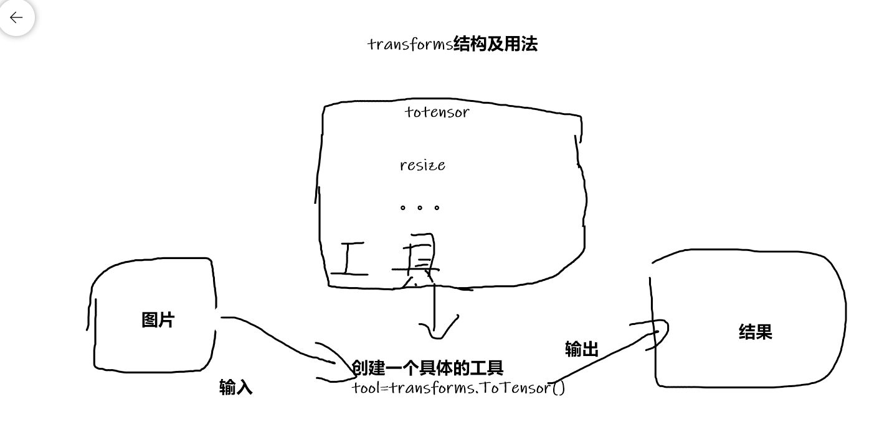
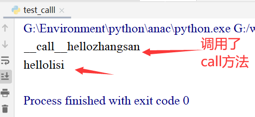
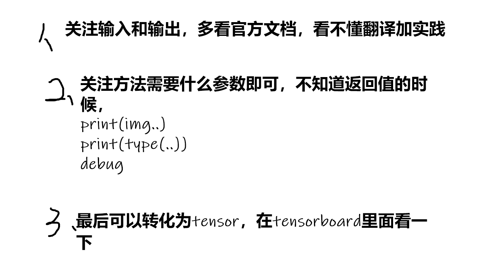
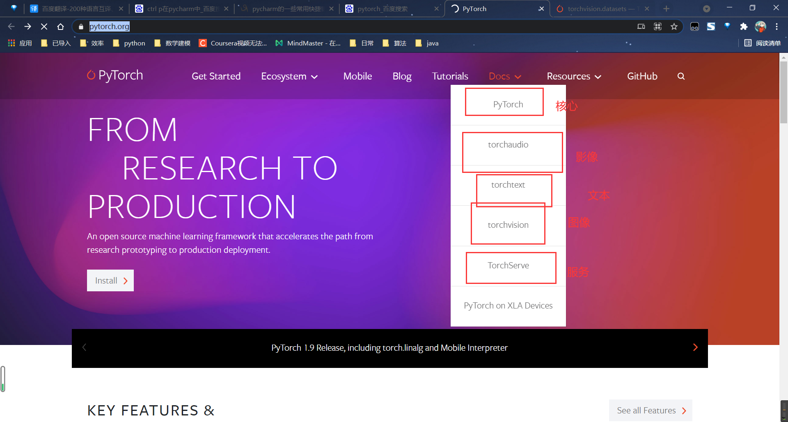
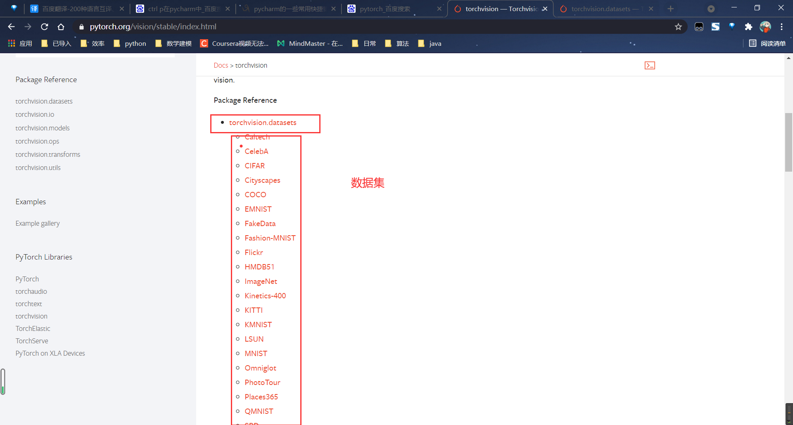

# pyTorch深度学习快速入门

## P6、Dataset类代码实战

**目标一：读取目标路径下的文件名？**

```python
class MyData(Dataset):
    def __init__(self,root_dir,label_dir):
        self.root_dir=root_dir
        self.label_dir=label_dir
        #获得对应的地址
        # root_dir 根目录地址
        # label_path 标签地址，通常只要一个标签的名字，接下来会将他们合起来
        self.path=os.path.join(root_dir,label_dir)
    #     接下来获取对应目录下的图片地址
    #     listdir（）将目录里面的文件转化为一个列表
        self.image_path=os.listdir(self.path)
```


==主要讲解了如何读取有许多数据的文件夹里面的数据==

```python
from torch.utils.data import Dataset
# help(Dataset)
import cv2
from PIL import Image
import os
class MyData(Dataset):
    def __init__(self,root_dir,label_dir):
        self.root_dir=root_dir
        self.label_dir=label_dir
        #获得对应的地址
        # root_dir 根目录地址
        # label_path 标签地址，通常只要一个标签的名字，接下来会将他们合起来
        self.path=os.path.join(root_dir,label_dir)
    #     接下来获取对应目录下的图片地址
    #     listdir（）将目录里面的文件转化为一个列表
        self.image_path=os.listdir(self.path)

    def __getitem__(self, index):
        # 函数作用：获取其中每一个图片
        img_name=self.image_path[index]
        '''将路径的路径的相对地址，标签的名字，图片的名字拼接起来，形成一个真正的图片路径'''
        img_item_path=os.path.join(self.root_dir,self.label_dir,img_name)
        # 获取了对应index的图片
        img=Image.open(img_item_path)
        label=self.label_dir
        return  img,label

    def __len__(self):
        return len(self.image_path)

root_dir='dataResourse/practise/train'
ants_label_dir='ants_image'
bees_label_dir='bees_image'
ants_dataset=MyData(root_dir,ants_label_dir)
bees_dataset=MyData(root_dir,bees_label_dir)

img,label=ants_dataset[0]
"把两个小的数据集进行拼接"
# 作用：可以仿照一个数据集和原来的混着用
train=ants_dataset+bees_dataset

# img2,label2=train[123]
# img2.show()
```


## P7、TensorBoard的使用

### 7.1、

TensorBoard 中有一个SummaryWriter函数可以画图 >-<

```python
from torch.utils.tensorboard import SummaryWriter

writter=SummaryWriter('logs')
for i in range(100):
    writter.add_scalar('y=x',i,i)

writter.close()
```


> tensorboard --logdir=logs


### 读图片


#### 1.用PIL的Image度


读出来的是PIL.JPEG不符合writter.add_image()的类型


#### 2.用OpenCV读取图片，获得numpy类型的图片


#### 3.用numpy


直接运行报错

```
from torch.utils.tensorboard import SummaryWriter
import numpy
from PIL import Image
# test1
'''
writter=SummaryWriter('logs')
for i in range(100):
    writter.add_scalar('y=x',i,i)

writter.close()
'''

# test2
image_path='dataResourse/practise/train/ants_image/0013035.jpg'
image_PIL=Image.open(image_path)
image_array=numpy.array(image_PIL)

writter=SummaryWriter('logs')
writter.add_image("test",image_array,1)

writter.close()
```


经过排查发现是sharp属性不对

默认是


而使用的image_array则是：

(512, 768, 3)与其相反

所以修改格式即可

```
dataformats='HWC'
```

```
writter.add_image("test",image_array,1,dataformats='HWC')
```


## P9、Transforms的使用

Transforms**结构及用法**


<PIL.JpegImagePlugin.JpegImageFile image mode=RGB size=500x500 at 0x1B6FDFA9F98>


```python
from PIL import Image
from torchvision import transforms

# python的用法-》   tensor数据类型
# 通过tensform.totensor去解决两个问题
# 1.transforms该如何使用
# 2.tensor数据类型相比其他数据类型有什么区别

# 绝对路径 G:\workSpace\new_code\python_learing\deeplearning\dataResourse\practise\train\ants_image\20935278_9190345f6b.jpg
# 相对路径 dataResourse/practise/train/ants_image/67270775_e9fdf77e9d.jpg

img_path = 'dataResourse/practise/train/ants_image/67270775_e9fdf77e9d.jpg'
img = Image.open(img_path)

print(img)
# 实例化对象，再调用，实现call方法， 再传进去参数    transforms不能传参
tensor_trans=transforms.ToTensor()
tensor_img=tensor_trans(img)#ctrl+p
print(tensor_img)
```




```tensorboard --logdir=logs
tensorboard --logdir=logs
```


## p10、常见的Transfroms


python中内置函数**==__call__==**的使用

——call——：可以在实例化时传入参数，就自动运行call的方法

其他类里面的方法。都需要再实例化之后再通过类.方法名来调用

```python
class Person():
    def __call__(self, name):
        print("__call__"+"hello"+name)

    def hello(self,name):
        print("hello"+name)

person=Person()
person("zhangsan")
person.hello('lisi')
```





### 1.Normalize归一化


```python
from PIL import Image
from torch.utils.tensorboard import SummaryWriter
from torchvision import transforms

writer=SummaryWriter('logs')
img=Image.open('image/img.png')
print(img)

trans_totensor=transforms.ToTensor()
tensor_img=trans_totensor(img)
writer.add_image('to_tensor',tensor_img)
writer.close()

#normalize
print(tensor_img[0][0][0])
trans_norm=transforms.Normalize([1,2,4],[4,5,1])
img_norm=trans_norm(tensor_img)
print(img_norm[0][0][0])
writer.add_image('normalize',tensor_img,1)

writer.close()
```

### 总结使用

```python
from PIL import Image
from torch.utils.tensorboard import SummaryWriter
from torchvision import transforms

writer=SummaryWriter('logs')
img=Image.open('image/img.png')
print(img)#PIL

trans_totensor=transforms.ToTensor()
tensor_img=trans_totensor(img)#tensor
writer.add_image('to_tensor',tensor_img)
writer.close()

#normalize
print(tensor_img[0][0][0])
trans_norm=transforms.Normalize([1,2,4],[4,5,1])
img_norm=trans_norm(tensor_img)
print(img_norm[0][0][0])
writer.add_image('normalize',tensor_img,1)

writer.close()


#resize
print(img.size)
trans_resize=transforms.Resize((512,512))
#img PIL —>reszie  img_size  PIL
img_resize=trans_resize(img)
#img_resize  PIL —> totensor _>img_resize  tensor
img_resize=trans_totensor(img_resize)
print(img_resize)

writer.add_image('resize',img_resize,0)

writer.close()

# compose ()   resize_2
trans_resize_2=transforms.Resize(512)
trans_compose=transforms.Compose([trans_resize_2,trans_totensor])
img_resize_2=trans_compose(img)
writer.add_image('resize',img_resize_2,1)

#randomCrop
tran_random=transforms.RandomCrop(400)
trans_compose_2=transforms.Compose([tran_random,trans_totensor])
for i in range(10):
    img_crop=trans_compose_2(img)
    writer.add_image('randomcrop',img_crop,i)

writer.close()
```





## P14、torchvision的数据集的使用

pytorch官网   https://pytorch.org/



通常使用**torchvision**



